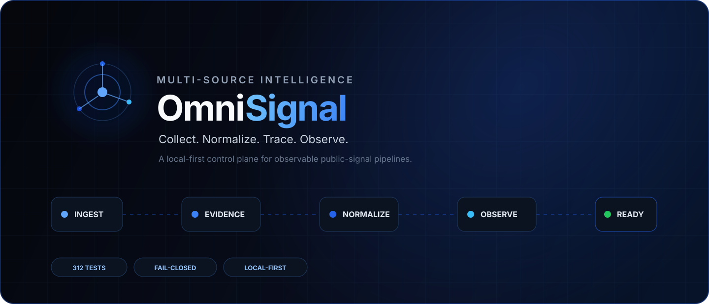
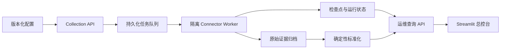

<p align="center">
  
</p>

<p align="center">
  <strong>把分散、易失真的外部检索信号，变成可追踪、可恢复、可审计的数据链路。</strong><br />
  面向公开检索与外部数据源的多源采集、标准化和可观测平台。
</p>

<p align="center">
  <a href="https://github.com/LazyS1a/OmniSignal/actions/workflows/ci.yml"></a>
  <a href="https://lazys1a.github.io/OmniSignal/"></a>
  <a href="https://github.com/LazyS1a/OmniSignal/releases"></a>
  <a href="https://www.python.org/"></a>
  <a href="LICENSE"></a>
</p>

<p align="center">
  <a href="#为什么做-omnisignal">项目定位</a> ·
  <a href="#在线只读-demo">在线 Demo</a> ·
  <a href="#系统架构">系统架构</a> ·
  <a href="#五分钟开始">快速开始</a> ·
  <a href="#可验证状态">验证状态</a> ·
  <a href="#运行边界">运行边界</a>
</p>

> 当前版本：`v0.2.0`。已完成干净环境部署、数据库故障恢复与真实公开数据链路验证；不宣称生产环境 SLA、全网绝对搜索量或无可信分母的跨平台市场份额。

## 在线只读 Demo

访问 **[OmniSignal Public Demo](https://lazys1a.github.io/OmniSignal/)**，无需安装即可查看运行总览、来源登记、采集任务、多日趋势、检索采样和证据质量页面。

公网版本是独立的静态演示层：只使用内嵌合成快照，不连接真实 API、不发起外部采集，也不保存任何操作。完整 FastAPI、数据库、Worker、凭据和控制能力仅在本地部署中提供。

## 为什么做 OmniSignal

多数采集 Demo 只回答“这次抓到了什么”。OmniSignal 更关心一条链路能否长期解释：**从哪里来、按什么配置采、失败在哪、原始证据是什么、如何重跑，以及结果能不能被审计。**

| 可靠执行 | 证据可追踪 | 故障不伪装 | 运维可控制 |
| --- | --- | --- | --- |
| 任务、运行状态和检查点持久化，支持幂等与断点续跑 | 原始响应以 SHA-256 关联标准记录、配置和处理版本 | 超时、限流、验证码、空切片和结构漂移独立记录 | 角色、确认短语、乐观版本与幂等键保护控制操作 |

## 系统架构



核心 API、连接器 Worker 与界面彼此分离。界面不直连数据库，也不能提交任意命令、模块路径、URL 或脚本；连接器只从服务端登记的固定任务和允许范围构造。

### 核心能力

- **统一连接器契约**：`ConnectorSpec` 描述来源类型、目标范围、鉴权引用、分页、字段白名单、检查点与错误分类。
- **持久化任务执行**：任务、运行状态和检查点落库，支持幂等写入、断点续跑、有限重试、来源停用与失败恢复。
- **逐切片故障诊断**：按关键词与引擎记录成功、空结果、限流、验证码、超时和结构漂移，允许部分覆盖完成。
- **原始证据与血缘**：压缩保存允许字段范围内的原始响应，并关联标准记录、配置版本和处理版本。
- **确定性标准化**：统一来源记录结构，保留质量状态、实体别名命中、上下文关系和重复候选。
- **统一运维控制面**：FastAPI 提供有界查询与受认证控制接口；Streamlit 展示来源、任务、运行、趋势、检索结果、质量和审计。
- **视觉工程骨架**：总控台可一键创建虚构咖啡海报示例，预览图片、查看已知图层位置并下载分层 PNG；也可创建空工程和上传本地 PNG。当前尚未接入自动元素识别、外部图片模型或 Photoshop。
- **本地优先部署**：提供 Windows 总控台入口、Docker Compose、迁移、健康检查、备份恢复脚本和 CI。

## 已实现的数据链路

- 公开搜索信号与联想词快照
- Web / 视频相对搜索兴趣序列
- YouTube 公开检索结果采样
- 本机多引擎 Web 检索结果采样
- GitHub 公开 Issue / PR 检索
- 白名单静态网页采集与正文提取
- File、REST、RSS、Browser、WebSocket 等连接器契约与受控夹具
- 授权 Hook / 私有接口的隔离 Worker 契约

项目输出的是**有限覆盖范围内的检索结果、相对指数和证据记录**。没有可信分母时不会生成“全网占比”，不同来源的指标也不会被硬拼成一个虚假总分。

## 五分钟开始

### 前置条件

- Python `3.12.x`
- [uv](https://docs.astral.sh/uv/) `0.12.8`
- Windows PowerShell；Docker Desktop 仅在 Compose 部署时需要

```powershell
git clone https://github.com/LazyS1a/OmniSignal.git
cd OmniSignal
uv sync --frozen --group dev --extra crawl --extra ui
uv run pytest -q
```

### Windows 本地总控台

完成依赖同步后，双击 `打开OmniSignal总控台.cmd`。入口会幂等迁移本地数据库，启动 FastAPI 与 Streamlit，健康检查通过后打开浏览器；重复执行不会启动第二套服务。

> 一键脚本默认把缓存放在 `D:\CodexCache\OmniSignal`。其他磁盘布局可先调整 `scripts/use-d-drive.ps1`，或直接使用 uv / Docker 命令启动。

以下均为本机回环地址，不是公网服务：

- 总控台：`http://127.0.0.1:8501`
- API readiness：`http://127.0.0.1:8010/health/ready`
- OpenAPI：`http://127.0.0.1:8010/docs`

### Docker Compose

Docker Desktop 显示 Engine running 后，可直接双击 `用Docker打开OmniSignal总控台.cmd`。入口会：

1. 首次生成并复用本机私有数据库密码与采集执行 token；
2. 构建并启动 PostgreSQL、FastAPI 和 Streamlit；
3. 等三个容器全部健康后打开 `http://127.0.0.1:8501`；
4. 重复双击时复用现有健康服务，不启动第二套。

私有 secrets、PostgreSQL 和应用数据保存在 `artifacts/private/docker-console/`，不会进入 Git。双击 `关闭Docker版OmniSignal总控台.cmd` 只停止本项目容器，保留数据供下次启动。

视觉工作台的工程清单、上传图和示例图层保存在应用数据目录中；容器重启不会丢失。打开左侧“视觉实验 → 视觉工作台”，点击“创建合成咖啡海报”即可查看第一份分层样本。设计与接入边界见 [视觉工作台](docs/visual_workbench.md)。

> 如果本机 8010 或 8501 已被其他服务占用，入口会在构建前停止并提示，不会结束占用进程。先关闭本地 Python 版总控台，或在 PowerShell 中用 `scripts/start-docker-console.ps1 -ApiPort 18010 -UiPort 18501` 指定其他端口。

也可以手动使用 Compose。只设置数据库密码时，UI 为只读模式：

数据库密码只放在当前终端环境中：

```powershell
$env:OMNISIGNAL_DB_PASSWORD = "replace-with-a-strong-local-password"
docker compose up --build
```

服务默认只绑定本机回环地址。运行数据、数据库、备份、日志与原始归档均被排除在 Git 仓库之外。SearXNG 仍是可选采集依赖，不会因为打开 Docker 总控台而自动请求外部搜索引擎。

发布前或升级后可运行 `.\scripts\test-clean-environment.ps1`，在隔离的空数据库上验证构建、迁移、数据库中断恢复、API 重启和调度关闭；它不会发起采集。完整升级与回退步骤见 [部署生命周期](docs/deployment_lifecycle.md)。

## 可验证状态

| 检查项 | `v0.2.0` 基线 |
| --- | --- |
| 自动化测试 | 314 passed |
| 覆盖层级 | 契约、幂等、断点、故障分类、权限、审计、API、UI、恢复 |
| 容器构建 | API 与 PostgreSQL 镜像可由 Compose 构建；空数据库自动迁移并通过重启验证 |
| 恢复演练 | PostgreSQL 备份可恢复到独立容器/独立卷，并在重启后保持 schema revision |
| 公开树审计 | 无数据库、备份、运行日志、私有计划与真实凭据 |
| 调度策略 | 默认关闭，不会因启动界面自动请求外部平台 |

上述是当前版本的可复现实验基线，不等同于长期生产 SLA。持续集成状态以页首 CI 徽章为准。

## 技术栈

`Python 3.12` · `FastAPI` · `SQLAlchemy` · `Alembic` · `PostgreSQL` · `SQLite` · `Streamlit` · `Docker Compose` · `SearXNG` · `Scrapy` · `Pytest`

依赖版本由 `pyproject.toml` 与 `uv.lock` 固定。核心业务逻辑通过内部协议与具体采集、存储、界面实现隔离。

## 目录结构

```text
src/omnisignal/    核心服务、连接器、存储、标准化与运维 API
tests/             单元、契约、API、UI 与故障恢复测试
schemas/           ConnectorSpec 与 MetricSpec JSON Schema
config/            固定任务与版本化配置入口
examples/          脱敏连接器、策略和指标示例
governance/        来源登记、数据策略与威胁模型
reverse_lab/       与核心采集隔离的授权分析实验壳
scripts/           启动、停止、采集、健康检查与恢复脚本
docs/              接口、连接器、运维、恢复说明与视觉资产
```

## 运行边界

- 不绕过登录、验证码、付费墙、访问控制或平台限制。
- 不把相对趋势、联想排名或 Top-K 结果样本表述为真实绝对搜索次数。
- 不保存非必要个人信息；凭证只通过环境变量引用进入运行进程。
- 授权 Hook 与逆向实验仅面向自有、开源练习样本或明确授权目标，并与核心服务隔离。
- 视觉参考图只登记来源与使用依据；当前不会自动下载、破解原始工程或把重建图层表述为原始 PSD。
- 项目止于可靠采集、标准化、质量与运维能力，不评价产品，也不生成产品改进建议。

## 项目状态与协作

`v0.2.0` 是稳定性收尾版本：补齐独立 PostgreSQL 恢复、数据库不可达安全失败、干净环境复现、容器运行配置和部署回退说明。多日运行、异地恢复和真实上游凭据仍需外部环境形成证据，不继续无边界扩充来源数量。

- 版本变化见 [CHANGELOG.md](CHANGELOG.md)
- 开发约定见 [CONTRIBUTING.md](CONTRIBUTING.md)
- 连接器契约见 [Connector SDK](docs/connector_sdk.md)
- 视觉工程与模型 / Photoshop 适配边界见 [视觉工作台](docs/visual_workbench.md)
- 部署恢复见 [部署生命周期](docs/deployment_lifecycle.md) 与 [恢复手册](docs/recovery_runbook.md)
- 安全问题见 [SECURITY.md](SECURITY.md)

## License

OmniSignal 自有源码以 [MIT License](LICENSE) 发布。第三方依赖仍分别适用其自身许可证。
