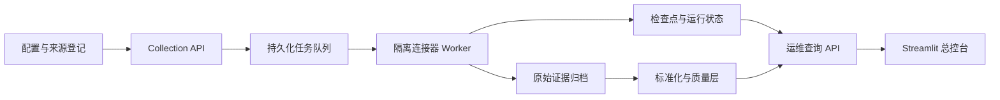

# OmniSignal

面向公开检索与外部数据源的多源采集、标准化和可观测平台。

OmniSignal 将来源接入、任务执行、原始证据、标准化处理、质量状态和运维控制统一到一条可追踪链路中。系统强调故障隔离与证据边界：来源超时、限流、验证码或结构变化不会被静默解释为“零结果”，也不会让单个来源故障拖垮整个任务。

> 当前版本：`0.1.0`，个人开源项目。本版本完成本地部署与真实公开数据链路验证；不宣称生产环境 SLA、全网搜索量或跨平台市场份额。

## 核心能力

- **统一连接器契约**：用 `ConnectorSpec` 描述来源类型、目标范围、鉴权引用、分页、字段白名单、检查点与错误分类。
- **持久化任务执行**：任务、运行状态和检查点落库，支持幂等写入、断点续跑、有限重试、来源停用与失败恢复。
- **逐切片故障诊断**：按关键词和引擎记录成功、空结果、限流、验证码、超时与结构漂移，允许任务以部分覆盖状态完成。
- **原始证据与血缘**：压缩保存允许字段范围内的原始响应，通过 SHA-256 关联标准记录、配置版本和处理版本。
- **确定性标准化**：统一不同来源的记录结构，保存质量状态、实体别名命中、上下文关系与重复候选。
- **运维控制面**：FastAPI 提供有界查询和受认证控制接口；Streamlit 总控台展示来源、任务、运行、趋势、检索结果、质量和审计。
- **安全运行边界**：控制操作要求角色、确认短语、乐观版本和幂等键；令牌不进入数据库、日志、URL 或导出文件。
- **本地可部署**：提供 Windows 一键入口、Docker Compose、数据库迁移、健康检查、备份恢复脚本和 CI。

## 系统架构



核心 API、连接器 Worker 与界面彼此分离。界面不直接访问数据库，也不能提交任意命令、模块路径、URL 或脚本；连接器只能从服务端登记的固定任务和允许范围构造。

## 已实现的数据链路

- 公开搜索信号与联想词快照
- Web/视频相对搜索兴趣序列
- YouTube 公开检索结果采样
- 本机多引擎 Web 检索结果采样
- GitHub 公开 Issue/PR 检索
- 白名单静态网页采集与正文提取
- 文件、REST、RSS、Browser、WebSocket 等连接器契约与受控夹具
- 授权 Hook/私有接口的隔离 Worker 契约

项目输出的是**有限覆盖范围内的检索结果、相对指数和证据记录**。没有合法分母时不会生成“全网占比”，不同来源的指标也不会被直接拼接成一个虚假的总分。

## 技术栈

`Python 3.12` · `FastAPI` · `SQLAlchemy` · `Alembic` · `PostgreSQL` · `SQLite` · `Streamlit` · `Docker Compose` · `SearXNG` · `Scrapy` · `Pytest`

依赖版本由 `pyproject.toml` 与 `uv.lock` 固定。核心业务逻辑通过内部协议与具体采集、存储和界面实现隔离。

## 快速开始

### Windows 一键总控台

项目已完成本地环境初始化时，双击：

```text
打开OmniSignal总控台.cmd
```

入口会检查并迁移本地数据库，启动 FastAPI 与 Streamlit，健康检查通过后打开浏览器。重复执行不会启动第二套服务。结束时双击：

```text
关闭OmniSignal总控台.cmd
```

默认地址：

- 运维总控台：`http://127.0.0.1:8501`
- API 就绪检查：`http://127.0.0.1:8010/health/ready`
- OpenAPI：`http://127.0.0.1:8010/docs`

### Python 本地测试

```powershell
.\scripts\test-local.ps1
```

当前基线：312 项自动化测试，覆盖连接器契约、幂等、断点、故障分类、权限、审计、API、界面和恢复流程。

### Docker Compose

数据库密码只放在当前终端环境中：

```powershell
$env:OMNISIGNAL_DB_PASSWORD = "replace-with-a-strong-local-password"
docker compose up --build
```

服务默认只绑定本机回环地址。运行数据、数据库、备份、日志和原始归档均被排除在 Git 仓库之外。

## 目录结构

```text
src/omnisignal/    核心服务、连接器、存储、标准化与运维 API
tests/             单元、契约、API、UI 与故障恢复测试
schemas/           ConnectorSpec 与 MetricSpec JSON Schema
config/            固定任务与版本化配置入口
examples/          脱敏连接器、策略和指标示例
governance/        来源登记、数据策略与威胁模型
reverse_lab/       与核心采集隔离的授权分析实验壳
scripts/           启动、停止、采集、健康检查与恢复脚本
docs/              接口、连接器、运维和恢复说明
```

## 运行边界

- 不绕过登录、验证码、付费墙、访问控制或平台限制。
- 不把相对趋势、联想排名或 Top-K 结果样本表述为真实绝对搜索次数。
- 不保存非必要个人信息；凭证只通过环境变量引用进入运行进程。
- 授权 Hook 与逆向实验仅面向自有、开源练习样本或明确授权目标，并与核心服务隔离。
- 项目止于可靠采集、标准化、质量与运维能力，不评价产品，也不生成产品改进建议。

## 当前状态

`v0.1.0` 完成可公开审阅的本地版本。后续工作集中在长期运行观测、独立 PostgreSQL 恢复演练、负载测试和干净环境复现，不继续无边界扩充来源数量。

## License

OmniSignal 自有源码以 [MIT License](LICENSE) 发布。第三方依赖仍分别适用其自身许可证。
